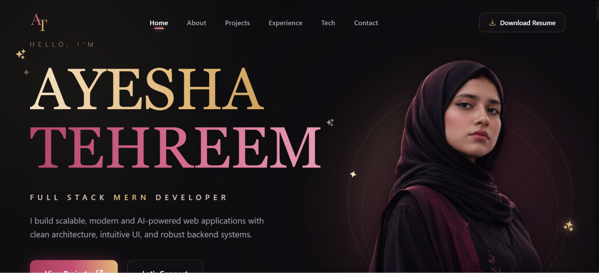

# Ayesha Tehreem — Full Stack MERN Developer



A modern and elegant personal portfolio built to showcase my projects, technical skills, and experience as a Full Stack MERN Developer. The website focuses on clean design, smooth interactions, responsive layouts, and a professional user experience.

---

## 🌐 Live Demo

🔗 [https://your-vercel-link.vercel.app](https://ayesha-tehreem-portfolio.vercel.app/)

---

## ✨ Features

- Elegant modern UI
- Fully responsive design
- Smooth scrolling navigation
- Interactive project showcase
- Project case study modal
- Resume download
- Contact form with EmailJS
- Premium animations
- Optimized performance

---

## 🚀 Featured Projects

### Time Capsule

A secure digital memory vault where users can schedule messages, files, and media to be unlocked automatically in the future.

**Tech Stack**

- React
- NestJS
- MongoDB
- Cloudinary
- JWT
- Stripe
- Resend

---

### Zarmina

A full-stack clothing web application with product management, authentication, and responsive shopping experience.

**Tech Stack**

- React
- NestJS
- MongoDB

---

## 🛠 Tech Stack

### Frontend

- React
- Vite
- Tailwind CSS
- JavaScript (ES6+)

### Backend

- NestJS
- Node.js
- MongoDB

### Tools

- Git
- GitHub
- VS Code
- Cloudinary
- EmailJS
- Vercel

---

## ⚙ Installation

Clone the repository

```bash
git clone https://github.com/ayeshatehreem77/ayesha-tehreem-portfolio.git
```

Move into the project

```bash
cd ayesha-tehreem-portfolio
```

Install dependencies

```bash
npm install
```

Run development server

```bash
npm run dev
```

Create production build

```bash
npm run build
```

---

## 📂 Folder Structure

```
src
 ├── assets
 ├── components
 │    ├── contact
 │    ├── experience
 │    ├── exploring
 │    ├── process
 │    ├── projects
 │    └── sections
 │    └── techStack
 ├── data
 ├── hooks
 ├── utils
 ├── App.jsx
 └── main.jsx
```

---

## 📬 Contact

- LinkedIn: [https://linkedin.com/in/YOUR-LINKEDIN](https://www.linkedin.com/in/ayesha-tehreem-289346321/)
- GitHub: [https://github.com/ayeshatehreem77](https://github.com/ayeshatehreem77)
- Email: ayeshatehreem556@gmail.com

---

## 📄 License

This project is created for portfolio purposes.

© 2026 Ayesha Tehreem
